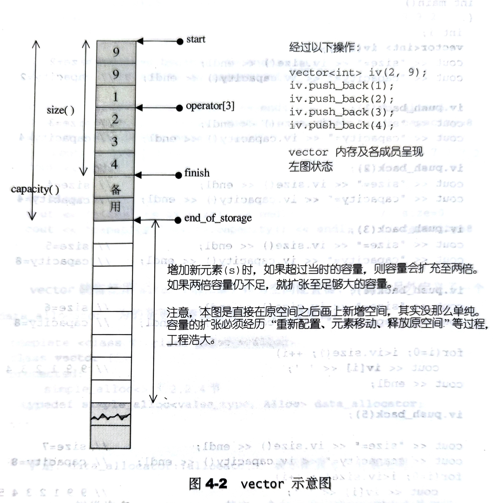
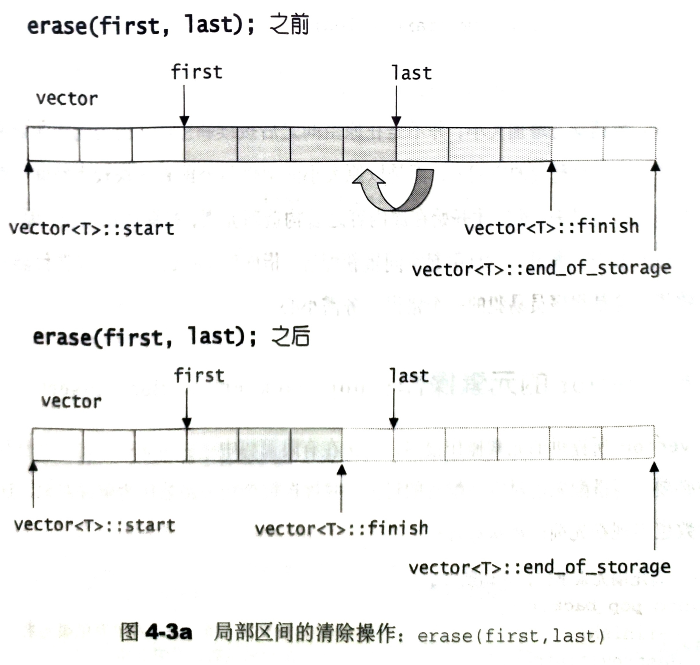

# 4.2 vector

## 4.2.1 vector概述

vector是动态数组，随着新元素的加入，它的内部会自行扩充空间以容纳新元素。

vector的实现技术，关键在于其对大小的控制以及重新配置时的数据移动效率。一如稍早所说，是“配置新空间/数据移动/释放旧空间”的大工程，时间成本很高，应该加入某种未雨绸缪的考虑。稍后我们便可看到SGI vector的空间配置策略。

## 4.2.2 vector定义摘要

以下是vector定义的源码摘录。SGI STL将vector实现于更底层的 `<stl_vector.h>`。

```cpp
// alloc 是SGI STL的空间配置器，见第二章
template <class T, class Alloc = alloc>
class vector {
public:
  // vector的嵌套类型定义
  typedef T           value_type;
  typedef value_type* pointer;
  typedef value_type* iterator;
  typedef value_type& reference;
  typedef size_t      size_type;
  typedef ptrdiff_t   difference_type;

protected:
  // simple_alloc 是SGI STL的空间配置器，见2.2.4
  typedef simple_alloc<value_type, Alloc> data_allocator;

  iterator start;           // 表示目前使用空间的头
  iterator finish;          // 表示目前使用空间的尾
  iterator end_of_storage;  // 表示目前可用空间的尾

  void insert_aux(iterator position, const T& x);
  void deallocate() {
    if (start) 
      data_allocator::deallocate(start, end_of_storage - start);
  }

  void fill_initialize(size_type n, const T& value) {
    start = allocate_and_fill(n, value);
    finish = start + n;
    end_of_storage = finish;
  }

public:
  iterator begin() { return start; }
  iterator end() { return finish; }
  size_t size() const { return size_type(end() - begin()); }
  size_t capacity() const { return size_type(end_of_storage - begin()); }
  bool empty() const { return begin() == end(); }
  reference operator[](size_type n) { return *(begin() + n); }

  vector() : start(0), finish(0), end_of_storage(0) { }
  vector(size_type n, const T& value) { fill_initialize(n, value); }
  vector(int n, const T& value) { fill_initialize(n, value); }
  vector(long n, const T& value) { fill_initialize(n, value); }
  explicit vector(size_type n) { fill_initialize(n, T()); }

  ~vector() {
    destroy(start, finish);                 // 见2.2.3
    deallocate();                           // member function
  }
  reference front() { return *begin(); }    // 第一个元素
  reference back() { return *(end() - 1); } // 最后一个元素
  void push_back(const T& x) {              // 将元素插入至最尾端
    if (finish!= end_of_storage) {
      construct(finish, x);                 // 见2.2.3
      ++finish;
    }
    else
      insert_aux(end(), x);                 // member function
  }

  void pop_back() {                         // 删除最后一个元素
    --finish;
    destroy(finish);                        // 见2.2.3
  }

  iterator erase(iterator position) {        // 删除指定位置的元素
    if (position + 1 != end())
      copy(position + 1, finish, position);  // 后续元素向前移动
    --finish;
    destroy(finish);                         // 见2.2.3
    return position;
  }
  void resize(size_type new_size, const T& x) {
    if (new_size < size()) 
      erase(begin() + new_size, end());
    else
      insert(end(), new_size - size(), x);
  }
  void resize(size_type new_size) { resize(new_size, T()); }
  void clear() { erase(begin(), end()); }

protected:
  // 配置空间并填满内容
  iterator allocate_and_fill(size_type n, const T& x) {
    iterator result = data_allocator::allocate(n);
    uninitialized_fill_n(result, n, x);     // 见2.2.3
    return result;
  }
};
```

## 4.2.3 vector的迭代器

普通指针可以作为vector的迭代器而满足所有必要条件。vector支持随机存取，而普通指针正有这样的能力。所以，vector提供的是Random Access Iterator。

```cpp
template <class T, class Alloc = alloc>
class vector {
public:
  typedef T           value_type;
  typedef value_type* iterator;  //vector的迭代器是普通指针
  ...
};
```

根据上述定义，如果写出这样的代码：

```cpp
vector<int>::iterator ivite;
vector<Shape>::iterator svite;
```

ivite的类型其实就是 `int*`，svite的类型其实就是 `Shape*`。

## 4.2.4 vector的数据结构

vector所采用的数据结构是线性连续空间。它以两个迭代器start和finish分别指向配置得来的连续空间中目前已被使用的范围，并以迭代器end_of_storage指向整块连续空间（含备用空间）的尾端：

```cpp
template <class T, class Alloc = alloc>
class vector {
  ...
protected:
  iterator start;           // 表示目前使用空间的头
  iterator finish;          // 表示目前使用空间的尾
  iterator end_of_storage;  // 表示目前可用空间的尾
  ...
};
```

为了降低空间配置时的速度成本，vector实际配置的大小可能比用户需求量更大一些，以备扩充。这便是容量的观念。一旦容量等于大学奥，便是满载。下次再有新增元素，整个vector就扩容。

运用start, finish, end_of_storage这三个迭代器，就可以很容易的提供首位标示、大小、容量、空容器判断、下标运算符、最前端数值、最后后端数值等功能。



## 4.2.5 vector的构造和内存管理：constructor，push_back

vector缺省使用alloc作为空间配置器，并据此另外定义了一个data_allocator，为的是更方便以元素大小为配置单位：

```cpp
template <class T, class Alloc = alloc>
class vector {
  ...
protected:
  // simple_alloc<> 见2.2.4
  typedef simple_alloc<value_type, Alloc> data_allocator;
  ...
};
```

于是，`data_allocator::allocate(n)` 表示配置n个元素的空间。

vector提供许多ctors，其中一个允许我们指定空间大小及初值：

```cpp
// 构造函数，允许指定vector大小n和初值value
vector(size_t n, const T& value) { fill_initialized(n, value); }

// 填充并予以初始化
void fill_initialized(size_t n, const T& value) {
  start = allocate_and_fill(n, value);
  finish = start + n;
  end_of_storage = finish;
}

// 配置而后填充
iterator allocate_and_fill(size_type n, const T& x) {
  iterator result = data_allocator::allocate(n);    // 配置n个元素的空间
  uninitialized_fill_n(result, n, x);               // 全局函数，见2.3
  return result;
}
```

`uninitialized_fill_n()` 会根据第一参数的类型特性决定使用 `fill_n()` 或 `construct()` 来完成任务（见2.3）。

当我们以 `push_back()` 将新元素插入vector尾端时，该函数首先检查是否还有备用空间，如果有就直接在备用空间上构造元素，并调整迭代器finish，使vector变大。如果没有备用空间，就扩充空间。

```cpp
void push_back(cont T& x) {
  if (finish != end_of_storage) {       // 还有备用空间
    construct(finish, *(finish - 1));   // 将元素构造到备用空间 见2.2.3
    ++finish;                           // 调整迭代器
  }  
  else                                  // 没有备用空间
    insert_aux(end(), x);               // member function
}

template <class T, class Alloc>
void vector<T, Alloc>::insert_aux(iterator position, const T& x) {
  if (finish!= end_of_storage) {        // 还有备用空间
    // 在备用空间起始处构造一个元素，并以vector最后一个元素值为其初值 
    construct(finish, *(finish - 1));   
    ++finish;                           // 调整迭代器
    T x_copy = x;
    copy_backward(position, finish - 2, finish - 1);
    *position = x_copy;
  }
  else {                                // 已无备用空间
    const size_type old_size = size();
    const size_type len = old_size!= 0? 2 * old_size : 1;
    // 配置原则：如果原大小为0，则配置1
    // 如果原大小不为0，则配置原大小的两倍
    // 前半段用来放置数据，后半段准备用来放置新数据

    iterator new_start = data_allocator::allocate(len); // 实际配置
    iterator new_finish = new_start;
    try {
      // 将原vector的内容拷贝到新vector
      new_finish = uninitialized_copy(start, position, new_start);
      // 为新元素设定初值x
      construct(new_finish, x);
      // 调整迭代器
      ++new_finish;
      // 将按插点的原内容也拷贝过来 （提示：该函数也可能被insert(p, x)调用）
      new_finish = uninitialized_copy(position, finish, new_finish);
    } catch (...) {
      // "commit or rollback" semantics
      destroy(new_start, new_finish);
      data_allocator::deallocate(new_start, len);
      throw;
    }

    // 析构并释放原vector
    destroy(begin(), end());
    deallocate();

    //调整迭代器，指向新vector
    start = new_start;
    finish = new_finish;
    end_of_storage = new_start + len;
  }
}
```

动态增加大小，是以原大小的两倍另外配置一块较大空间，然后将原内容拷贝过来，然后再原内容之后构造新元素，并释放原空间。因此，对vector的任何操作，一旦引起空间重新配置，指向原vector的所有迭代器就都失效了。

## 4.2.6 vector的元素操作：pop_back, erase, clear, insert

```cpp
// 将尾端元素拿掉， 并调整大小
void pop_back() {
  --finish;         // 将尾端标记往前一格，表示放弃尾端元素
  destroy(finish);  // 见第二章
}

// 清除 [first, last) 中的所有元素
void erase(iterator first, iterator last) {
  iterator i = copy(;ast, finish, first);   // 见第六章
  destroy(i, finish);                       // 见第二章
  finish = finish - (last - first);          
  return first;
}

// 清除某个位置上的元素
iterator erase(iterator position) {
  if (position + 1 != end())
    copy(position + 1, finish, position);
  --finish;
  destroy(finish);
  return position;
}

void clear() { erase(begin(), end()); }
```



```cpp
// 从position开始，插入n个元素，元素初值为x
template <class T, class Alloc>
void vector<T, Alloc>::insert(iterator position, size_type n, const value_type& x) {
  if (n != 0) { // 当n != 0时才进行以下所有操作
    if (size_type(end_of_storage - finish) >= n) { // 如果大小足够
      T x_copy = x;
      // 以下计算插入点之后的现有元素个数
      const size_type elems_after = finish - position;
      iterator old_finish = finish;
      if (elems_after > n) { // 如果插入点之后的元素个数大于新增元素个数
        uninitialized_copy(finish - n, finish, finish);
        finish += n;        // 将vector尾端标记后移
        copy_backward(position, old_finish - n, old_finish);
        fill(position, position + n, x_copy);   // 从新插入点开始填入新值
      }
      else {
        // 插入点之后的现有元素个数小于等于新增元素个数
        uninitialized_fill_n(finish, n - elems_after, x_copy);
        finish += n - elems_after;
        uninitialized_copy(position, old_finish, finish);
        finish += elems_after;
        fill(position, old_finish, x_copy);
      }
    }
    else {
      // 备用空间小于新增元素个数
      // 首先按决定新长度：旧长度的两倍，或就长度+新元素个数
      const size_type old_size = size();
      const size_type len = old_size + max(old_size, n);
      // 以下配置新的vector空间
      iterator new_start = data_allocator::allocate(len);
      iterator new_finish = new_start;
      __STL_TRY {
        // 首先将旧vector的插入点之前的元素复制到新空间
        new_finish = uninitialized_copy(start, position, new_start);
        // 再将新增元素填入新空间
        new_finish = uninitialized_fill_n(new_finish, n, x_copy);
        // 再将旧vector的插入点之后的元素复制到新空间
        new_finish = uninitialized_copy(position, finish, new_finish);
      }
# ifdef __STL_USE_EXCEPTIONS
      catch(...) {
        // "commit or rollback" semantics
        destroy(new_start, new_finish);
        data_allocator::deallocate(new_start, len);
        throw;
      }
# endif /* __STL_USE_EXCEPTIONS */
      // 删除旧vector
      destroy(start, finish);
      deallocate();
      // 更新vector的开始点和结束点
      start = new_start;
      finish = new_finish;
      end_of_storage = new_start + len;
    }
  }
}
```

注意，插入完成后，新节点位于position节点的前方。


