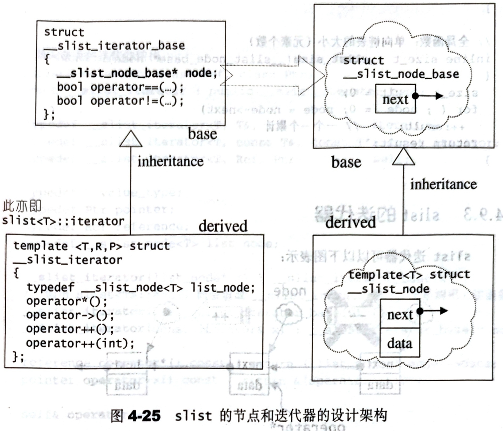
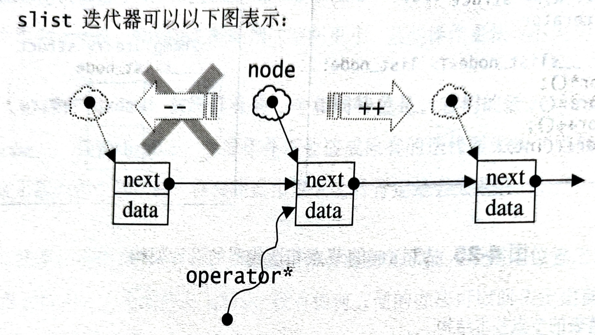

# 4.9 slist

## 4.9.1 slist 概述

slist 是一个单向链表。这个容器并不在标准规格内。

slit 的迭代器属于单向的 ForwardIterator。

注意，作为单向链表，insert 或 erase 操作函数没有任何方便的办法回头定出前一个位置，因此它必须从头找起。为此，slist 特别提供了 `insert_after` 或 `erase_after` 操作。

基于效率考虑，slist 不提供 `push_back()` ，只提供 `push_front()`。因此 slist 的元素次序会和元素插入进来的次序相反。

## 4.9.2 slist 的节点

slist 节点和其迭代器的设计，架构上比 list 复杂许多，运用了继承关系。



```cpp
// 单向链表的基本结构
struct __slist_node_base {
  __slist_node_base* prev;
};

// 单向链表的节点结构
template <class T>
struct __slist_node : public __slist_node_base {
  T data;
};

// 全局函数：已知某一节点，插入新节点于其后
inline __slist_node_base* __slist_make_link(
  __slist_node_base* prev_node,
  __slist_node_base* new_node) {
  // 令新节点的下一节点为 prev 节点的下一节点
  new_node->next = prev_node->next;
  // 令 prev 节点的下一节点指向新节点
  prev_node->next = new_node;
  return new_node;
}

// 从头开始：单链表的大小（元素个数）
inline size_t __slist_size(__slist_node_base* node) {
  size_t result = 0;
  for (; node; node = node->next)
    ++result;
  return result;
}
```

## 4.9.3 slist 的迭代器

slist 迭代器可以以下图表示：



实际构造如下。注意它和节点的关系。

```cpp
// 单向链表的迭代器基本结构
struct __slist_iterator_base {
  typedef size_t size_type;
  typedef ptrdiff_t difference_type;
  typedef forward_iterator_tag iterator_category;  // 单向迭代器

  __slist_node_base* node;  // 指向节点的基本结构

  __slist_iterator_base(__slist_node_base* x) : node(x) {}

  void incr() { node = node->next; }  // 前进一个节点

  bool operator==(const __slist_iterator_base& x) const {
    return node == x.node;
  }
  bool operator!=(const __slist_iterator_base& x) const {
    return node != x.node;
  }
};

// 单向链表的迭代器的结构
template <class T, class Ref, class Ptr>
struct __slist_iterator : public __slist_iterator_base {
  typedef __slist_iterator<T, T&, T*>             iterator;
  typedef __slist_iterator<T, const T&, const T*> const_iterator;
  typedef __slist_iterator<T, Ref, Ptr>           self;

  typedef T value_type;
  typedef Ptr pointer;
  typedef Ref reference;
  typedef __slist_node<T> list_node;

  __slist_iterator(list_node* x) : __slist_iterator_base(x) {}
  // 调用 slist<T>::end() 时会造成__slist_iterator_base(0)，于是调用上述函数
  __slist_iterator() : __slist_iterator_base(0) {}
  __slist_iterator(const iterator& x) : __slist_iterator_base(x.node) {}  

  reference operator*() const { return ((list_node*)node)->data; }
  pointer operator->() const { return &(operator*()); }

  self& operator++() {
    incur();  // 前进一个节点
    return *this;
  }
  self operator++(int) {
    self tmp = *this;
    incur();
    return tmp;
  }
  
  // 没有实现 operator--，因为这是一个 forward iterator
};
```

注意，比较两个 slist_iterator 是否相等时，由于 `__slist_iterator` 并未对 `operator==` 进行实现，所以会调用 `__slist_iterator_base::operator==`。根据其定义，两个 slist 迭代器是否相等，视其 `__slist_node_base* node` 是否相等而定。

## 4.9.4 slist 的数据结构

```cpp
template <class T, class Alloc = alloc>
class slist {
public:
  typedef T value_type;
  typedef value_type* pointer;
  typedef value_type& reference;
  typedef const value_type& const_reference;
  typedef size_t size_type;
  typedef ptrdiff_t difference_type;

  typedef __slist_iterator<T, T&, T*> iterator;
  typedef __slist_iterator<T, const T&, const T*> const_iterator;

private:
  typedef __slist_node<T> list_node;
  typedef __slist_node_base list_node_base;
  typedef __slist_iterator_base iterator_base;
  typedef simple_alloc<list_node, Alloc> list_node_allocator;

  static list_node* create_node(const value_type& x) {
    list_node* node = list_node_allocator::allocate();
    try {
      construct(&node->data, x);
      node->next = 0;
    }
    __STL_UNWIND(list_node_allocator::deallocate(node));
    return node;
  }

  static void destroy_node(list_node* node) {
    destroy(&node->data);   // 将元素析构
    list_node_allocator::deallocate(node);  // 释放空间
  }

private:
  list_node_base head;  // 头部 注意，它不是指针，是实例

public:
  slist() { head.next = 0; }
  ~slist() { clear(); }

public:
  iterator begin() { return iterator(head.next); }
  iterator end() { return iterator(&head); }
  size_type size() const { return __slist_size(head.next); }
  bool empty() const { return head.next == 0; }

  // 两个 slist 交换：只要将 head 交换即可
  void swap(slist& L) {
    list_node_base* tmp = head.next;
    head.next = L.head.next;
    L.head.next = tmp;
  }

public:
  // 取头部元素
  reference front() { return *begin(); }

  // 从头部插入元素
  void push_front(const value_type& x) {
    __slist_make_link(&head, create_node(x));
  }

  // 注意，没有 push_back()

  // 从头部取走元素，修改 head
  void pop_front() {
    list_node* node = (list_node*) head.next;
    head.next = node->next;
    destroy_node(node);
  }
  ...
};
```
